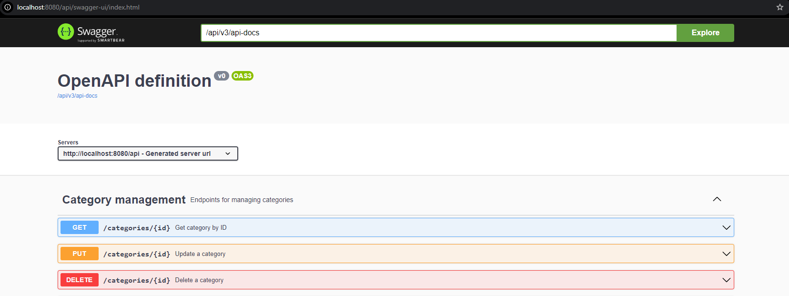

# Online Bookstore

## Project Description

The **Online Bookstore** is a web application that allows users to browse, search, and purchase books from a variety of categories.
It offers a user-friendly interface for book selection and management, with features for both general users and administrators.
The app uses Java-based server technologies and ensures secure, scalable, and flexible book management.

## Current Functionality

### User Roles
- **USER**: Default role assigned to new users.
- **ADMIN**: Role with additional privileges for managing books, categories, and orders.

### Key Features
- User registration and authentication using **JWT**.
- Browse and search books by categories or parameters.
- Add books to a shopping cart and place orders.
- Manage user orders and shopping carts.

## Technologies and Tools

- **Java 17**
- **Spring Boot**: Backend framework.
- **Spring Security**: Authentication and authorization using JWT.
- **Spring Data JPA**: Data persistence.
- **MySQL**: Database.
- **Liquibase**: Database schema versioning.
- **Docker**: Containerization for application deployment.
- **Swagger**: API documentation.
- **Junit**, **Mockito**, **Testcontainers**: Testing frameworks.

## API Endpoints

### Authentication Management
- **POST /auth/register**: Register a new user.
- **POST /auth/login**: User login.

### Order Management
- **GET /orders**: Retrieve user’s order history.
- **POST /orders**: Place an order.
- **PATCH /orders/{id}**: Update order status.
- **GET /orders/{orderId}/items**: Retrieve all items for an order.

### Category Management
- **GET /categories**: Find all categories.
- **POST /categories**: Save a new category.
- **GET /categories/{id}**: Find category by ID.
- **POST /categories/{id}**: Update category.
- **DELETE /categories/{id}**: Delete category by ID.

### Shopping Cart Management
- **GET /cart**: Retrieve user’s shopping cart.
- **POST /cart**: Add a book to the cart.
- **PUT /cart/cart-items/{cartItemId}**: Update item quantity in the cart.
- **DELETE /cart/cart-items/{cartItemId}**: Remove an item from the cart.

### Book Management
- **GET /books**: Find all books.
- **POST /books**: Save a new book.
- **GET /books/{id}**: Find book by ID.
- **POST /books/{id}**: Update book details.
- **DELETE /books/{id}**: Delete book by ID.

## Running the Project
Clone the repository (make sure you have JDK installed):
git clone https://github.com/VKhmil/Book-shop

Navigate to the project directory:
cd online-book-store

Build the project using Maven:
mvn clean install

Run the application:
mvn spring-boot:run

Access the application at: http://localhost:8080

Alternatively, use Docker (make sure you have Docker installed):
docker-compose up

## Challenges and Solutions

- Security Implementation: Integrated Spring Security and JWT to secure the application.
- Database Management: Used Liquibase to handle database schema changes smoothly.
- Exception Handling: Implemented servlet layer handling for JWT expiration to enhance security and user experience.

## Swagger
Swagger is available for testing at http://localhost:8080/swagger-ui/index.html

## Conclusion
For more information or further assistance, feel free to open an issue in the project repository or contact the development team.